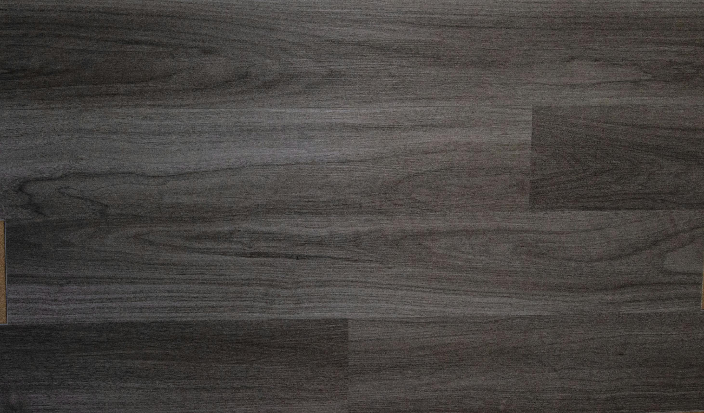
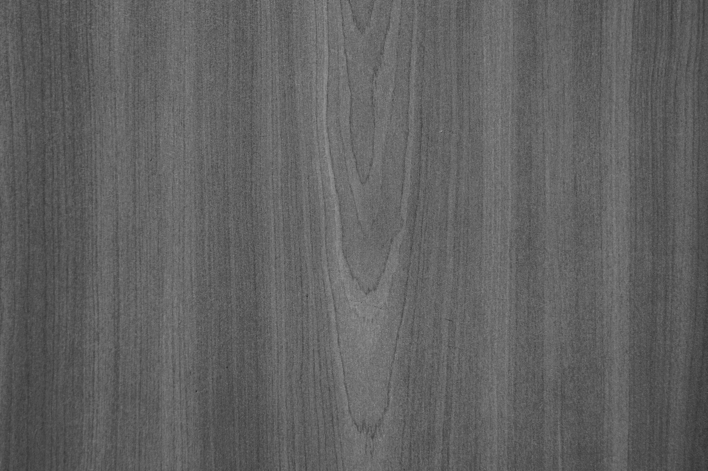
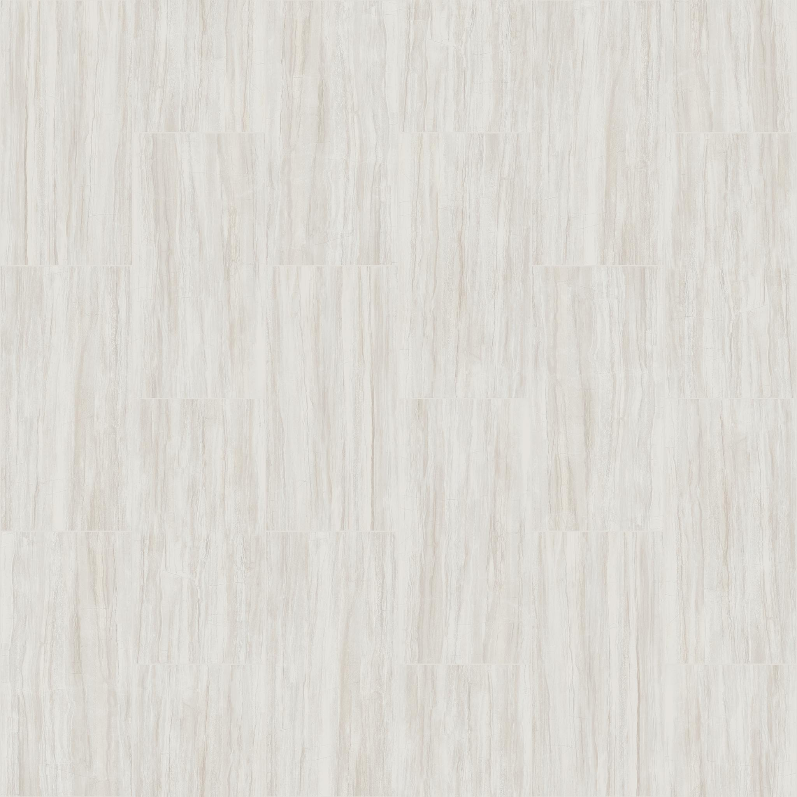

<div align="center">
  
  <h1><b>PVC Project</b></h1>
  <p><b>Plataforma moderna y optimizada para la gestión y venta de productos de PVC</b></p>
  <p>
    
    
    
    
  </p>
</div>

---

## 📝 Descripción General

**PVC Project** es una plataforma web responsiva, eficiente y visualmente atractiva para la gestión, visualización y venta de productos de PVC. Incluye autenticación segura, panel de administración, carrito de compras optimizado y un frontend moderno, pensado para funcionar perfectamente en dispositivos móviles y equipos de gama baja.

---

## 🚩 Características Destacadas

- **Frontend moderno y responsivo** (HTML5, CSS3, JS)
- **Catálogo de productos** con imágenes, descripciones y categorías
- **Buscador global** instantáneo
- **Carrito de compras interactivo y ultra-ligero** (auto-añadido, mobile friendly)
- **Descuentos destacados**
- **Login seguro** (tradicional y Google OAuth 2.0)
- **Panel de administración** para gestión avanzada
- **Optimización para móviles y bajo consumo de recursos**

---

## 🖥️ Interfaz de Usuario

<div align="center">
  
</div>

<div align="center">
  <table>
    <tr>
      <td align="center"></td>
      <td align="center"></td>
      <td align="center"></td>
    </tr>
  </table>
</div>

> El diseño utiliza **Boxicons**, **Google Fonts** (Bebas Neue, Gidole, Poppins) y animaciones suaves para una experiencia premium.

---

## 🎥 Demo

<div align="center">
  <a href="https://www.youtube.com/watch?v=dQw4w9WgXcQ" target="_blank">
    
    <br>
    <b>Ver demo en YouTube</b>
  </a>
</div>

---

## 🛠️ Tecnologías Utilizadas

- **Frontend:** HTML5, CSS3, JavaScript (Vanilla)
- **Backend:** PHP 8+
- **Base de datos:** MySQL (vía PDO)
- **Autenticación:** Google OAuth 2.0
- **Dependencias:** Composer

---

## 📦 Instalación Rápida

1. **Clona** este repositorio en tu servidor local (XAMPP recomendado).
2. Ejecuta `composer install` para instalar las dependencias PHP.
3. Configura tu base de datos y ajusta los datos de conexión en `conexion.php`.
4. Registra tu URI de redirección en Google Cloud Console para el login con Google.
5. Accede a `http://localhost/pvc_project/` en tu navegador.

---

## 📁 Estructura del Proyecto

```text
pvc_project/
├── frontend/
│   ├── index.css
│   ├── header.css
│   ├── component/
│   │   ├── main.css
│   │   └── variables.css
│   └── js/
│       ├── buscador.js
│       ├── carrito.js
│       └── ...
├── img/
├── php/
│   ├── components/
│   │   └── header.php
│   ├── google_oauth.php
│   └── ...
├── admin/
├── uploads/
└── index.php
```

---

## 🔒 Seguridad y Buenas Prácticas

- **Nunca subas tus secretos (Client ID/Secret) al repositorio.** Usa archivos ignorados como `config_oauth.php`.
- **Utiliza HTTPS** en producción para proteger los datos de tus usuarios.
- **Actualiza dependencias** regularmente con Composer.
- **Haz backup de tu base de datos** periódicamente.

---

## 📱 Optimización para Móviles y Rendimiento

- **Carrito ultra-ligero**: Sin animaciones pesadas ni efectos complejos
- **Carga rápida** y bajo consumo de recursos
- **Interfaz adaptada** para pantallas pequeñas
- **Funciona perfectamente en dispositivos de gama baja**

---

## 👨‍💻 Autor

**Carlos Reyes**  
[LinkedIn](https://www.linkedin.com/in/tu-perfil) | [GitHub](https://github.com/carlo1404) | [Email](mailto:brunoreyes150@gmail.com)

---

<div align="center">
  <b>© 2024 Carlos Reyes</b><br>
  Este proyecto es de uso personal y educativo. Todos los derechos reservados.<br>
  <b>¡Gracias por usar y contribuir a PVC Project!</b>
</div> 